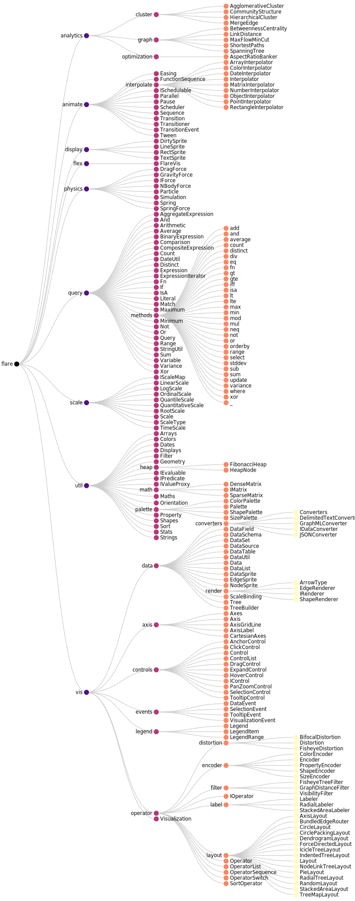
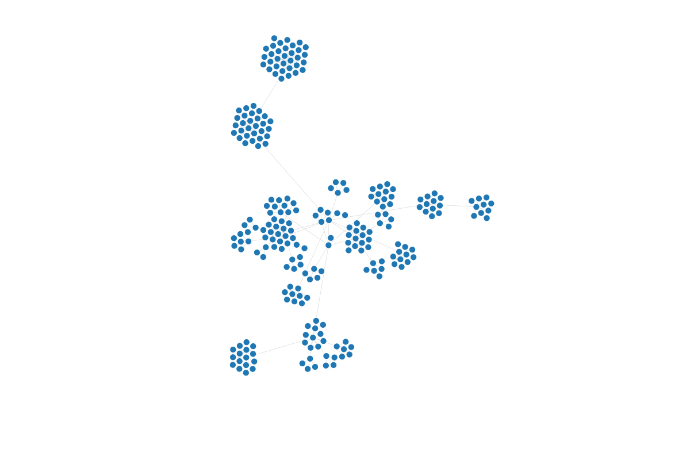

# PSGraph

  

> **PSGraph is a PowerShell-first wrapper around the ⚡ QuickGraph / QuikGraph** ecosystem.  
> It lets you **build, query and visualise graphs directly from the pipeline** without
> dropping down to C# or external tools. Think *LINQ for graphs* – but in PowerShell.

---

## Why another graph module?

QuickGraph/QuikGraph gives .NET a battle-tested set of graph data-structures and algorithms (DFS, BFS, Dijkstra, min-cut, spanning-tree, etc.) :contentReference[oaicite:0]{index=0}.  
PSGraph layers **PowerShell ergonomics, discoverability and visualisation** on top so that:

* You can **pipe any object collection** into a graph, specify what constitutes vertices
  and edges, and explore the relationships immediately.
* Results stay as native objects – ideal for further CLI
  processing, reporting or automation.

The original goal was to **analyse dependencies** in IaC workloads, but the module has proven handy for **network flows, security events, configuration drift** 

---

## Features at a glance

|                                   | What you get |
|-----------------------------------|--------------|
| **Idiomatic cmdlets**             | `New-PSGraph`, `Add-PSVertex`, `Add-PSEdge`, `Get-GraphPath`, … |
| **Ready-made algorithms**         | All algorithms exposed by QuikGraph are one cmdlet away. |
| **Batteries-included visualisation** | Render to GraphViz (`*.dot`, `png`, `svg`) or to JSON for Vega/D3 dashboards. |
| **Pipeline-friendly**             | Import/Export from CSV, JSON, XML, SQL, REST or live objects. |
| **Test-driven**                   | Over 100 Pester tests ensure every cmdlet does what it says. |
| **Cross-platform**                | Runs anywhere PowerShell 7+ does (Windows, Linux, macOS). |

---

## Quick install

```powershell
Install-Module -Name PSQuickGraph -Scope CurrentUser
```

**An example of Cartesian layouts for a node-link diagram of hierarchical data.**

```pwsh
$data = (Invoke-WebRequest -Uri https://raw.githubusercontent.com/vega/vega-datasets/refs/heads/main/data/flare.json).Content | ConvertFrom-Json
$index = [object[]]::new($data.count + 1)
$data | % { $index[$_.id] = $_ }

$g = new-graph

$data | Group-Object -Property parent | % {
    $currentGroup = $_
    if ([string]::IsNullOrEmpty($currentGroup.name)) {
        $currentGroup.Group | % {
            Add-Vertex -Vertex $_.name -Graph $g
        }
    }
    else {
        $parentLabel = $index[$currentGroup.name].name
        $currentGroup.Group | % {
            Add-Edge -From $parentLabel -To $_.name -Graph $g
        }
    }
}

$tempDir = [System.IO.Path]::GetTempPath() 
$outFile = Join-Path $tempDir 'x.tree.html'
Export-Graph -Graph $g -Format Vega_TreeLayout -Path $outFile
```




**Same graph but using Force Directed layout**

```pwsh
$tempDir = [System.IO.Path]::GetTempPath() 
$outFile = Join-Path $tempDir 'x.force.html'
Export-Graph -Graph $g -Format Vega_ForceDirected -Path $outFile
```



---

## DSM Clustering (Design Structure Matrix)

PSGraph includes experimental DSM clustering capabilities with two algorithms:

* Classic (simulated annealing heuristic)
* GraphBased (SCC condensation + topological ordering)

You can tune algorithms via a single `-AlgorithmConfig` parameter that accepts:

* A strongly typed record (`[PSGraph.DesignStructureMatrix.DsmSimulatedAnnealingConfig]`)
* A hashtable / ordered dictionary
* A `PSCustomObject`

### Quick Example (Hashtable configuration)

```powershell
$dsm = New-Dsm -Graph (New-Graph | % { Add-Vertex -Graph $_ -Vertex 'A' }) # minimal placeholder

# Build a sample dependency graph
$g = New-Graph
'A','B','C','D' | ForEach-Object { Add-Vertex -Graph $g -Vertex $_ | Out-Null }
Add-Edge -From A -To B -Graph $g | Out-Null
Add-Edge -From B -To C -Graph $g | Out-Null
Add-Edge -From C -To A -Graph $g | Out-Null # cycle
Add-Edge -From C -To D -Graph $g | Out-Null
$dsm = New-Dsm -Graph $g

# Run classic clustering (simulated annealing) with a tuned config
$cfg = @{ Times = 2; StableLimit = 2; MaxRepeat = 200; PowCc = 1 }
$result = Start-DSMClustering -Dsm $dsm -ClusteringAlgorithm Classic -AlgorithmConfig $cfg -Detailed

$result.Passes       # number of passes performed
$result.BestCost     # best coordination cost achieved
$result.CostHistory  # cost trajectory
```

### Strongly Typed Config Example

```powershell
$saCfg = [PSGraph.DesignStructureMatrix.DsmSimulatedAnnealingConfig]::new(
    PowCc = 1,
    PowBid = 0,
    PowDep = 0,
    Times = 3,
    StableLimit = 2,
    MaxRepeat = 500,
    InitialTemperature = $null,
    CoolingRate = 0.92,
    MinTemperature = 0.001
)
$result = Start-DSMClustering -Dsm $dsm -ClusteringAlgorithm Classic -AlgorithmConfig $saCfg -Detailed
```

### Graph-Based (Deterministic) Example

```powershell
$graphResult = Start-DSMClustering -Dsm $dsm -ClusteringAlgorithm GraphBased -Detailed
$graphResult.CostHistory # single value: cross-SCC edge count
```

> Tip: For hashtable / PSCustomObject configs, keys are matched case-insensitively to record constructor parameters. Missing values fall back to defaults.

### Simulated Annealing Parameters Explained

These fields tune the Classic (simulated annealing) DSM clustering. Use a strongly typed `DsmSimulatedAnnealingConfig`, or supply them via hashtable / PSCustomObject.

| Parameter | Role / Effect | Raise To | Lower To |
|-----------|---------------|----------|----------|
| `PowCc` | Exponent on cluster size in intra / extra cluster cost (penalises large clusters). | Split oversized clusters more aggressively. | Allow larger clusters. |
| `PowBid` | Exponent on cluster size in bid denominator ( (inOut^PowDep)/(size^PowBid) ). | Bias toward smaller clusters. | Reduce size pressure. |
| `PowDep` | Exponent amplifying interaction strength (inOut) in bid numerator. | Emphasise strong coupling. | Downplay link intensity. |
| `Times` | Move attempts per pass = `Times * N`. | More exploration (slower). | Faster passes, less search. |
| `StableLimit` | Passes w/out improvement before considered stable. | Avoid premature convergence. | Stop earlier. |
| `MaxRepeat` | Hard cap on passes. | Permit longer searches. | Force early cutoff. |
| `InitialTemperature` | Starting T; null ⇒ auto-scale to initial cost (adaptive). | Accept more uphill moves early. | Greedier start. |
| `CoolingRate` | Per-pass decay (`T *= CoolingRate`). | Maintain exploration longer. | Freeze faster. |
| `MinTemperature` | Convergence threshold on T. | Extend late stochastic phase. | Terminate sooner. |

Heuristics:
* Quick coarse result: `Times=1`, `CoolingRate=0.90`, lower `MaxRepeat`.
* Higher quality dense graphs: `Times=5+`, `CoolingRate=0.97..0.99`, higher `StableLimit`.
* Discourage giant clusters: raise `PowCc` / `PowBid`.
* Emphasise connectivity: raise `PowDep`.

Example tuned config:

```powershell
$saCfg = [pscustomobject]@{
    PowCc = 1; PowBid = 1; PowDep = 1;
    Times = 5; StableLimit = 3; MaxRepeat = 800;
    InitialTemperature = $null; # auto-scale to initial cost
    CoolingRate = 0.985; MinTemperature = 0.0005
}
$result = Start-DSMClustering -Dsm $dsm -ClusteringAlgorithm Classic -AlgorithmConfig $saCfg -Detailed
```

Leaving `InitialTemperature` as `$null` makes runs scale-aware across different matrix sizes; set a numeric value for strict comparability.

---